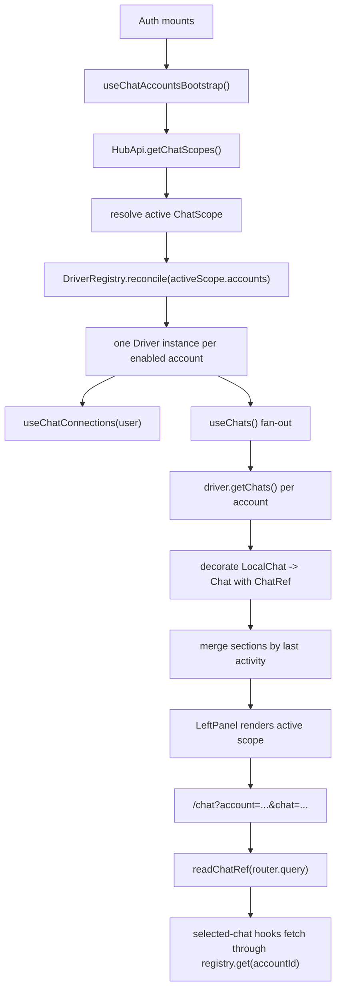

# Multi-Account Chat Architecture

This document explains how the Hub frontend handles chat accounts and chat
drivers. It is intended for new contributors who need to understand the
multi-account chat layer before changing it.

## Goal

The chat UI must support several future modes with the same architecture:

- one account connected to one chat server;
- several accounts displayed in the same conversation list;
- several accounts of the same driver kind, or different driver kinds, mixed
  together;
- a Discord-like server switcher where the user selects another chat scope and
  that scope may contain only one server.

The current implementation uses two mocked accounts so the frontend can exercise
the multi-account model without backend support yet. The architecture already
keeps the Matrix path ready, but the production backend does not expose chat
accounts for now.

## Key Ideas

### Hub API and Chat Drivers Are Separate

`HubApi` is the API of the Hub application itself. It owns Hub resources such as
frontend config, Hub users, the list of chat scopes, and the account manifest of
the active scope.

`Driver` is the API of one chat backend account. A driver can be a mock driver,
a Matrix driver, or another backend adapter later. It owns chat data and chat
connection logic for a single account.

This separation matters because the Hub decides which accounts exist, while each
driver knows how to talk to one server.

Relevant files:

- `src/frontend/apps/hub/src/features/config/HubApi.ts`
- `src/frontend/apps/hub/src/features/drivers/Driver.ts`
- `src/frontend/apps/hub/src/features/drivers/DriverRegistry.ts`

### ChatRef Is the Selected Chat Identity

Never identify a selected conversation with a bare `chatId`. Different accounts
can expose the same local chat id.

The selected chat identity is:

```ts
type ChatRef = {
  accountId: string;
  chatId: string;
};
```

Every selected-chat hook, cache key, route, mutation, and event bridge must use a
full `ChatRef`.

### LocalChat vs Chat

Drivers return local data:

```ts
type LocalChat = {
  id: string;
  name: string;
  section: "favourites" | "all";
  kind: "direct" | "group";
  visual: ChatVisual;
};
```

The application decorates local data with the account identity:

```ts
type Chat = LocalChat & {
  accountId: string;
  ref: ChatRef;
};
```

This keeps drivers simple: a driver only knows its local server ids. The app
layer turns those ids into globally safe identities.

### ChatVisual Is Display Metadata

`ChatVisual` describes how a chat row should render its avatar: initials, emoji,
or icon. It is not an identity field and should never be used to route or fetch
data.

### The Active Scope Can Be Aggregate or Single-Server

The current code receives one active chat scope, then reconciles that scope's
account manifest into the driver registry. Product-wise, a scope can represent
two different shapes:

- an aggregate scope, or "mega-server", where several accounts/drivers are
  active together and the conversation list is merged;
- a selected server scope, Discord-style, where the active scope contains only
  one account/driver even though other scopes exist elsewhere in the product.

The registry should not need to know why a manifest contains one account or many
accounts. It only reconciles the active manifest. A future server switcher should
therefore change the active manifest and let `DriverRegistry.reconcile()` create,
reuse, or destroy drivers accordingly.

This keeps the same code path for both UX modes:

- "show me everything" means the active manifest contains several accounts;
- "switch to server B" means the active manifest contains the account or
  accounts for server B only.

If the product later introduces explicit scope ids, keep one invariant in mind:
`accountId` must remain globally unique across every scope that can be routed to
directly. If that cannot be guaranteed, the route and cache model must gain a
`scopeId` dimension, for example `/chat?scope=...&account=...&chat=...`.

## Runtime Flow



## Account Bootstrap

`useChatAccountsBootstrap()` runs inside `Auth`.

It:

1. fetches available scopes with `HubApi.getChatScopes()`;
2. resolves the active scope from local storage, the default scope, or the first
   scope;
3. reconciles `activeScope.accounts` into the `DriverRegistry`;
4. destroys all drivers when the auth shell unmounts.

For now, `StandardHubApi.getChatScopes()` returns `DEFAULT_CHAT_SCOPES`:

- `mock-aggregate`, label `Tous les serveurs`, aggregate, default, containing
  `mock-main` and `mock-support`;
- `mock-hub`, label `Hub`, single-server, containing only `mock-main`;
- `mock-support`, label `Support`, single-server, containing only
  `mock-support`.

When the backend eventually exposes chat accounts, this method is the expected
swap point. The rest of the chat UI should not need to know whether the manifest
came from mocks or from a real API.

`HubApi.getChatAccounts(scopeId)` remains a convenience method for callers that
need only the accounts of one scope.

## Driver Registry

`DriverRegistry` is the single source of active driver instances.

It:

- creates one driver per enabled account;
- reuses an existing driver when the account id and kind still match;
- initializes newly-created drivers;
- destroys removed or replaced drivers;
- exposes a React subscription through `useDriverEntries()`.

Selected-chat hooks use `getRegistry().get(ref.accountId)` to route calls to the
correct driver.

For a future switcher, switching scope should call `reconcile()` with the new
scope's account configs. Drivers that are no longer in the active scope are
destroyed; drivers that remain active and keep the same kind are reused.

## Chat List Fetching

The UI does not pass an account id into `useChats()`. Instead, `useChats()` reads
all active accounts from `useDriverEntries()` and fans out:

1. one React Query query per account;
2. `entry.driver.getChats()` returns `LocalChatSections`;
3. `decorateChatSections(entry.accountId, sections)` adds `accountId` and
   `ref`;
4. sections from every account are merged and sorted.

This is how the left panel can show Hub and Support conversations in the same
list.

In a single-server selected scope, `useChats()` still follows the same fan-out
path, but there is only one active driver. Do not add a separate one-driver code
path unless the product needs genuinely different behavior; the manifest shape
is enough to express both modes.

`LeftPanel` renders the scope selector. When switching to a scope that no longer
contains the currently selected chat account, it navigates back to `/chat/new`
before applying the new scope. That prevents selected-chat hooks from trying to
fetch through a driver that has just been removed from the registry.

Required accounts and optional accounts are treated differently for loading UX:
a required account can block the initial chat readiness; an optional account can
fail without making the whole app unusable.

## Routing

There is one static exported page for selected conversations:

```text
/chat?account=<accountId>&chat=<chatId>
```

The helper functions are in `features/chat/chatRefs.ts`:

- `chatHref(ref)` builds route objects;
- `readChatRef(router.query)` parses the current route;
- `sameChatRef(a, b)` compares selected rows safely.

There is no `getStaticPaths` requirement. The frontend is a static export, and
chat selection is fully driven by runtime data and API calls.

The current route does not include a scope id. This is fine while `accountId`
globally identifies the selected backend account. If a future switcher allows
two scopes to reuse the same `accountId`, the route must add the scope id before
those scopes can be linked or restored safely.

## React Query Keys

All chat query keys are account-scoped:

- chat list for one account: `chatKeys.chatsOf(accountId)`;
- selected chat: `chatKeys.chat(ref)`;
- messages: `chatKeys.messages(ref)`;
- documents: `chatKeys.documents(ref)`;
- threads: `chatKeys.threads(ref)`;
- one thread: `chatKeys.thread(ref, threadId)`.

This prevents cache collisions when two accounts expose the same local chat id.

## Selected Chat Hooks

Selected-chat hooks accept a `ChatRef` and then route through the registry:

- `useChat(ref)`
- `useChatMessages(ref)`
- `useChatDocuments(ref)`
- `useChatThreads(ref)`
- `useChatThread(ref, threadId)`
- `useToggleReaction(ref, threadId?)`
- `useChatThreadActions(ref)`

The driver methods still receive local ids such as `chatId`, because the driver
already represents exactly one account.

## Real-Time Events

Each driver can expose one global event stream through `subscribeToEvents()`.

`useChatEvents()` subscribes once per active account. When an event arrives, it
stamps the event with the source `accountId`, builds the matching `ChatRef`, and
then either patches or invalidates the right React Query cache.

This design is deliberately global, not per open conversation. The app must
learn about new messages, unread states, and list changes even when the user is
viewing another conversation.

## Connection Lifecycle

`useChatConnections(user)` connects every active account.

The default driver connection is immediately `connected`, which is enough for
mock and cookie-based drivers. Matrix overrides the connection flow and can
return a `redirectTo` URL. `Auth` owns the actual browser redirect.

Connection state is stored in React Query, not in a custom global store.

## Matrix Preparation

The Matrix driver is not the active demo path today, but it is prepared for
multi-account use:

- the driver receives an `accountId`;
- local storage, session storage, IndexedDB sync store, and crypto store names
  are namespaced by account;
- OIDC pending state is account-scoped;
- callback handling ignores state that belongs to another account;
- `connect()` reports redirects instead of mutating `window.location` directly.

This avoids collisions if two Matrix accounts are connected later.

## Current Mock Setup

The mock driver is used to validate the architecture before backend support
exists. Both mocked accounts intentionally reuse the same local chat ids. This
tests the important invariant: account identity must always be part of selected
chat identity and cache keys.

The Support account applies mock settings such as a name suffix and a last
activity offset so the mixed list is visibly multi-account.

## How to Change Things

To add a new scope or account source, update `HubApi.getChatScopes()` or the
future backend endpoint it calls. Keep returning `ChatScope[]`.

To add or extend the server switcher:

1. model the selected server as an active chat scope;
2. fetch or build the list of `ChatScope` objects;
3. store the active `scopeId`;
4. call `DriverRegistry.reconcile()` with only that scope's active accounts;
5. keep `accountId` globally unique, or introduce `scopeId` in routes and cache
   keys before allowing duplicate account ids.

To add a new driver kind:

1. add the kind to `DriverKind`;
2. implement a `Driver` subclass;
3. update `createDriver(kind, accountId, settings)`;
4. add tests for registry creation, selected-chat hooks, and cache keys.

To add a new selected-chat feature:

1. accept `ChatRef`, not `chatId`;
2. build query keys with `chatKeys`;
3. route driver calls through `getRegistry().get(ref.accountId)`;
4. pass only local ids to the driver method.

To add list-level behavior:

1. fetch per account through `useDriverEntries()`;
2. decorate local data with `decorateChat*`;
3. merge at the app layer.

## Invariants

- A bare `chatId` is only safe inside a driver instance.
- UI state, URLs, React Query keys, and mutations must carry `ChatRef`.
- The Hub API discovers accounts; chat drivers fetch chat data.
- A driver represents one account, not one driver kind globally.
- The active manifest may describe an aggregate scope or a single-server scope;
  the registry should treat both the same way.
- A server switcher changes the active manifest; it should not add hidden
  special cases to selected-chat hooks.
- Real-time subscriptions are per account and global across that account's
  conversations.
- Static export stays static: no API routes, server components,
  `getServerSideProps`, or `getStaticPaths` for chat selection.

## Tests to Check When Editing

The most relevant tests are:

- `features/drivers/__tests__/DriverRegistry.test.ts`
- `features/chat/__tests__/chatRefs.test.ts`
- `features/chat/hooks/__tests__/useChats.test.tsx`
- selected-chat hook tests under `features/chat/hooks/__tests__/`
- E2E tests under `src/frontend/apps/e2e/__tests__/app-hub/`

The E2E left panel tests are especially useful because they validate the mixed
account list and navigation to `/chat?account=...&chat=...`.
